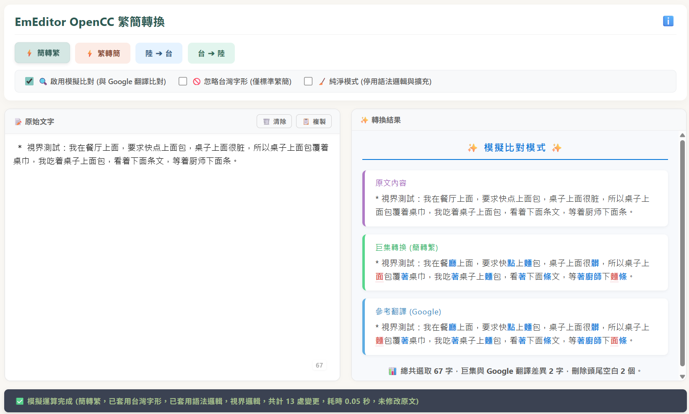

# 更新日誌 (Changelog)

所有關於 OpenCC for EmEditor 巨集的重大變更與更新都會記錄於此文件中。

## [v0.32] - 系統相容性修正與邏輯更新 2026-04-08
* **修正**：解除 ChatAI 插件依賴限制 (ChatAI Plugin Dependency Fix)。
  修復了在未安裝 ChatAI 插件的 EmEditor 環境下執行巨集時，可能會觸發錯誤或導致腳本中斷的問題，確保轉換引擎能完全獨立且穩定地運作。
* **優化**：微調語法邏輯 (Context Logic Fine-tuning)。
  微調邏輯順序與規則，減少不必要的運算開銷，使整體轉換速度成功加快約 0.2 秒。

## [v0.31] - 核心字典分流與執行效能 2026-04-03
* **優化**：邏輯詞庫空間解耦 (Dictionary Decoupling)。
持續更新語意邏輯的同時，也將「簡轉繁」與「繁轉簡」的邏輯詞庫進行物理分流。轉換時僅載入必要方向之字典，節省內存佔用，同時確保雙向轉換之底層核心算法保持相同架構。

* **優化**：ASCII 跳過機制 (Fast-Skip)。
針對底層掃描邏輯進行微調，實作「零成本預檢測」。當指針遇上 ASCII 字元（如 A-Z、0-9、半角空白及常用標點）時，直接跳過 FMM 匹配與 Context Logic 判定。

## [v0.30] - 視界邏輯引擎導入 2026-03-27
* **新增**：簡轉繁 實裝「視界邏輯 (Vision Logic)」轉換引擎，以 6-grid (六格) 深度探測機制與二層穩定性驗證。透過🔭「視界定錨」主動往後方掃描語意脈絡，強化判定詞組邊界。並以「視界護盾」與「三階語法辨析」實作長詞豁免機制與偏移判定。
  
  * 轉換流程：1. 讀取主字典映射 -> 2. 封裝 Trie 字典樹 -> 3. 視界邏輯 (Vision Logic) 4. 動態分段執行 FMM 匹配 -> 5. 語意邏輯 (Context Logic)
  * 視界測試：我在餐厅上面，要求快点上面包，桌子上面很脏，所以桌子上面包覆着桌巾，我吃着桌子上面包，看着下面条文，等着厨师下面条。
  * 參考結果：我在餐廳上面，要求快點上麵包，桌子上面很髒，所以桌子上面包覆著桌巾，我吃著桌子上麵包，看著下面條文，等著廚師下麵條。
    
* **優化**：配合 OpenCC 更新 STPhrases.txt 與 TSPhrases.txt 詞庫。持續強化語法邏輯，並全面改採 Set 化 $O(1)$ 檢索架構。
  

## [v0.29] - 精準選取範圍 2026-03-26
* **優化**：實作「動態座標捕捉」機制。解決 UTF-16 代理對 (Surrogate Pairs) 字元（如 𰾄 ⇄ 鋂）或長度不等寬詞彙（如 U盤 ⇄ 隨身碟）用語轉換後，選取的反白範圍發生偏移或「多吃字」的問題。
* **優化**：持續強化語法邏輯。

## [v0.28] - 視覺化進度條與詞庫更新 2026-03-25
* **新增**：導入簡易的「動態長高進度條」。採用 ▁▃▅▇ 四階高度符號實作次像素級 (Sub-pixel) 補間動畫，讓 GB 級大型文字檔案在處理過程中的視覺回饋更為直覺。
* **優化**：更新 STPhrases.txt 詞庫並持續強化語法邏輯之雙關語境辨識精度。
  * 例如處理 12% 時，EmEditor 視窗會顯示：

     ⏳ 繁轉簡 資料處理中，請稍候...  
     ▇▇▃▁▁▁▁▁▁▁▁▁▁▁▁▁▁▁▁▁ 12%  

## [v0.27] - 主從式彙整架構與效能校準 2026-03-24
* **優化**：核心轉換函式導入 「主從式彙整架構 (Master-Join Pattern)」。透過二階段字串彙整技術，減輕 V8 引擎在處理巨量陣列（3,600+ 萬次取代）時的記憶體索引壓力以提升速度，成功補回了導入「語法邏輯引擎」後產生的約 1 秒運算開銷，甚至更快。
* **優化**：持續優化語義辨識與詞庫權重校準，強化特定語境下的轉換精度，並擴展語法邏輯引擎的詞彙處理。

## [v0.26] - Web 轉換引擎與繁簡雙向語意 2026-03-21
* **新增**：推出跨平台免安裝的「Web 轉換引擎 (index.html)」，可直接於瀏覽器中簡易模擬 EmEditor 環境下的核心轉換邏輯效果，並支援即時的線上語系切換與翻譯比對。
* **增強**：繁轉簡 (T2S) 模式全面導入「語法邏輯引擎 (Context Logic)」，將歧義字重新定錨，並完整支援台灣字形的反向修正 (TWVariants Reversal)。
  * 語法測試：這邊住著名聲響亮的他合著眼，旁邊擺著名錶，心想：合著你這編著者打著名號、編著故事招搖撞騙的著作，是跟我合著的啊？
  * 參考結果：这边住着名声响亮的他合着眼，旁边摆着名表，心想：合着你这编著者打着名号、编着故事招摇撞骗的著作，是跟我合著的啊？

## [v0.25] - 語法邏輯引擎 2026-03-17
* **新增**：實裝輕量級「語法邏輯引擎 (ContextLogic)」與「雙關名單」機制，更精確判定「后/里/發/製」等 48 組常用歧義字語境，導入雙向（前綴/後綴）甚至三段式語意判定，提升特定詞彙的轉換準確度。
  * 語法測試：你别着恼，这只怪他乱发脾气，先回厂部办公室，用那陶瓷制的杯子，冲点咖啡搭配一个中式面包。
  * 參考結果：你別著惱，這只怪他亂發脾氣，先回廠部辦公室，用那陶瓷製的杯子，沖點咖啡搭配一個中式麵包。

## [v0.24] - 鍵盤熱鍵功能與比對視覺化 2026-03-14
* **新增**：實裝按住 Ctrl 鍵並點擊「巨集按鈕」即可觸發模擬比對模式，將轉換結果輸出至 WebBar 並彩色標記與線上翻譯比對之差異處。
* **新增**：目前簡轉繁預設使用台灣字形，實裝按住 [Alt] 即忽略台灣字形轉換及 [Shift] 啟動純淨模式，強制回歸最接近標準 OpenCC 之詞庫與單字匹配。

## [v0.23] - WebView 模擬比對 2026-03-13
* **新增**：正式實裝在 EmEditor 內建之網頁瀏覽器 (WebBar Object) 進行比對模式，使用者可透過 UI 界面直觀對照巨集和線上翻譯的繁簡轉換結果差異（預設為停用狀態）。

## [v0.22] - 效能與核心整合
* **新增**：特別感謝 EmEditor 作者 **江村 豊 (Yutaka Emura) 先生** 大力支援本巨集開發，特別於 v26.1 preview 1 (26.0.901) – March 11, 2026 起根據開發需求新增了 **TextLength** 屬性。此功能可快速檢測選取範圍大小，避免因 JavaScript 記憶體問題導致的當機風險。
* **優化**：將「**模擬比對引擎**」整合至主程式碼內，統一代碼架構以便於後續開發與維護。(模擬比對引擎 尚未釋出)

## [v0.21] - CSV 混合轉換與安全機制
* **優化**：導入 **CSV 智能處理系統**，系統將自動偵測不規則 CSV 檔案的複雜度並啟動三種處理模式：
  * **CSV 精確模式 (Absolute Defense Mode)**：針對包含儲存格內換行的複雜 CSV，啟動精確的逐格轉換，確保轉換正確。
  * **CSV 混合模式 (Hybrid Mode)**：針對包含不規則 CSV 儲存格的選取區，自動平衡速度與精確度。
  * **CSV 批次模式 (Bulk Mode)**：針對結構規整的 CSV 執行快速批次轉換，發揮最高的轉碼效率。

## [v0.20] - V8 引擎最佳化
* **優化**：導入「**字典樹 V8 最佳化引擎**」，改用 `charCodeAt` 與 `rootNodes` 首字快取陣列，徹底消除數千萬次字串物件分配開銷，大幅提升大數據處理效率。實測大檔案繁簡轉換 (3,000萬+ 處取代) 速度提升約 **15%~25%**。

## [v0.19] - 大數據穩定性與例外防火牆
* **新增**：區塊 E「**字形修正例外名單**」，建立優先權防火牆，保護『純喫茶』等品牌用字免遭單字規則誤轉，避免直接套用 S2TWP 模式所產生的過度轉換副作用。
* **優化**：採用「**延遲讀取**」技術偵測選取範圍，在 TextLength 可用之前，避免巨型檔案在選取時導致的記憶體溢位問題。

## [v0.18] - 精確填入與工具列同步
* **新增**：不規則 CSV 區域也能採用「**精確填入**」方式進行轉換，確保殘缺欄位轉換不位移。
* **支援**：CSV 模式上方「**儲存格編輯列**」可局部選取轉換，並自動恢復焦點與反白。

## [v0.17] - CSV 儲存格轉換
* **支援**：在 EmEditor 原生 CSV 模式下，能選取儲存格之後進行繁簡轉換。
* **防錯**：自動偵測並攔截超大型不規則欄位選取，避免資料推擠錯誤。

## [v0.16] - 萬用核心
* **重構**：提取出高度模組化的「萬用核心 (Universal Core)」，將五大分支代碼大一統。
* **文件**：更新專案文件標頭與聲明。

## [v0.15] - Undo 一次性復原
* **優化**：套用 EmEditor 原生 `CombineHistory` 屬性，取代舊有迴圈，實現「單鍵 Ctrl+Z」的一次性完美復原。

## [v0.14] - 垂直選取支援
* **修復**：突破底層座標運算盲區，精準支援 Alt 垂直區塊選取 (Box Mode)，徹底防止轉換範圍溢出至整行。

## [v0.13] - 建立系統防線
* **安全**：設立 1500 萬總行數的安全極限。
* **安全**：新增「單行大於 50MB」的巨型資料區塊攔截機制，避免極端檔案導致記憶體溢出崩潰。

## [v0.12] - 清除剪貼簿
* **效能**：加入轉換過程中的記憶體釋放機制，避免殘留龐大的暫存資料拖慢系統效能。

## [v0.11] - 篩選模式多段選取
* **功能**：攻克複雜的編輯器 UI 狀態，完美支援含有隱藏行的篩選模式 (Filter Mode)。
* **功能**：支援按住 Ctrl 進行的多段不連續選取轉換。

## [v0.10] - 擴充版分支
* **功能**：建立 `S2TE`、`TW2SP`、`S2TWP` 擴充分支。
* **詞庫**：引入包含 20,000+ 條非官方自訂覆寫的用語詞庫，滿足特定專業需求。

## [v0.09] - icon 導入
* **介面**：為巨集配置專屬的介面圖示 (`#icon`)，提升工具列按鈕的專業度與視覺識別性。

## [v0.08] - 進度顯示
* **介面**：加入轉換時的百分比進度提示，讓使用者在長時間運行時擁有明確的視覺反饋。

## [v0.07] - 導入切塊處理
* **核心**：研發「動態分段切塊 (Chunking)」機制，分批消化龐大資料，穩定超大檔 (4GB+) 轉換的可靠性。

## [v0.06] - 避免編輯器假死
* **效能**：優化 V8 引擎執行緒負載與介面重繪機制 (`Redraw`)，有效避免處理海量文字時系統無回應。

## [v0.05] - 導入字典樹
* **核心**：徹底捨棄低效比對，全面導入「Trie 字典樹 (Trie Tree)」，大幅提升龐大詞庫的檢索速度。

## [v0.04] - 大檔案處理
* **優化**：針對巨型檔案進行初步的記憶體與迴圈架構調整，挑戰軟體極限。

## [v0.03] - 正則處理
* **優化**：導入正則表達式 (Regex) 處理特定文字邊界與特徵，增強字串捕捉精準度。

## [v0.02] - FMM 正向最大匹配
* **核心**：實作 FMM 演算法，解決長詞優先與上下文「一對多」的字詞歧義問題。

## [v0.01] - C++ 加速取代
* **測試**：嘗試探求底層機制加速字串取代，尋求突破原生腳本的效能瓶頸。

## [v0.00] - 初始版
* **建立**：確立專案起點，建立基於 OpenCC 詞庫的基本繁簡字串替換雛形。
